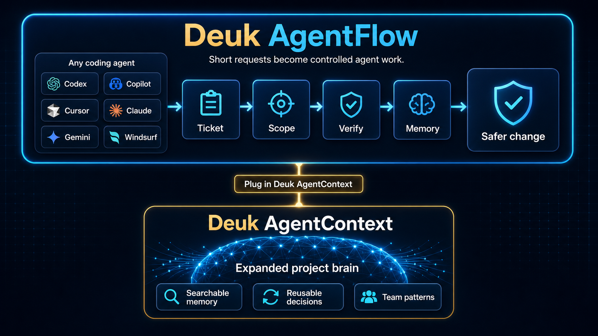
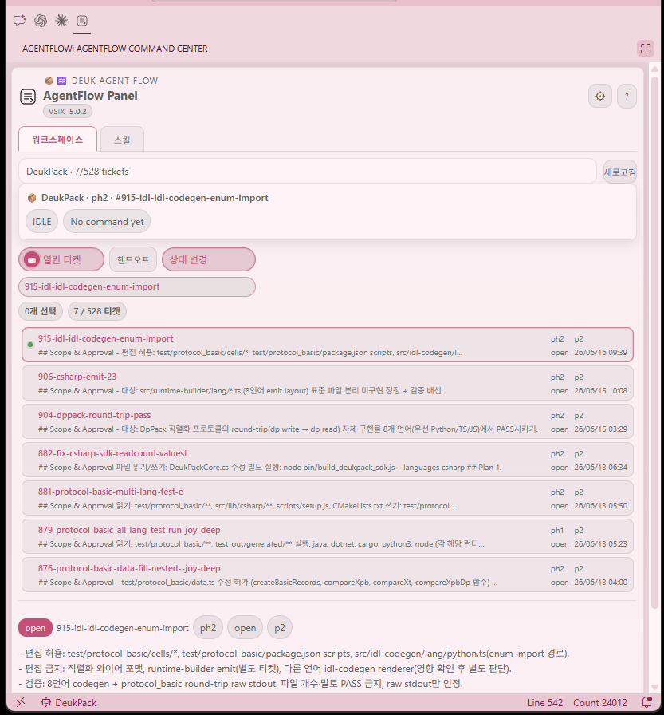

<div align="center">
  <br />
  
  <br />
  <h1>Deuk Agent Flow v5.0.2</h1>
  <p>
    <a href="https://www.npmjs.com/package/deuk-agent-flow"></a>
    <a href="https://www.npmjs.com/package/deuk-agent-flow"></a>
  </p>
  <p><b>Stop losing AI coding work between chats.</b></p>
  <p><i>Say "next" or "ship it"; Deuk Agent Flow keeps the ticket, scope, verification, and memory attached to your repo.</i></p>
  <p>Part of the <a href="https://deukpack.app">Deuk Family</a> ecosystem.</p>
  <p><a href="README.ko.md">한국어</a> · <a href="README.md">English</a></p>
</div>

---

**Deuk Agent Flow** is the repo-owned workflow layer for AI-assisted workspaces: planning, software engineering, systems work, research, and operations can enter the same ticketed flow through Codex, Copilot, Cursor, Claude Code, Gemini, Windsurf, or the next agent you adopt.

Most agent setups stop at instructions. Deuk Agent Flow turns short chat into an operating loop: ticket, scope, execute, verify, archive. It keeps `AGENTS.md`, Copilot instructions, Cursor rules, Claude skills, and related agent surfaces aligned without asking you to type long commands.

The hook is simple: you can say "next", "inspect", or "clean this up", and the current agent has a repo-owned place to know what that means. Active work lives in `~/.deuk/tickets/`; decisions, plans, and closeout evidence stay with the codebase instead of vanishing into a chat transcript. **Deuk Agent Flow** is the workflow layer. Plug that flow into the separate companion product **Deuk AgentContext**, and the whole repo gains an expanded project brain: searchable memory, reusable decisions, and team patterns the next agent can actually use.

### Why Now

AI coding has crossed from novelty into production volume:

- Google says **75% of its new code is AI-generated**, up from 25% in 2024 and 50% last fall. ([Semafor, 2026](https://www.semafor.com/article/04/24/2026/google-ceo-says-75-of-companys-new-code-is-ai-generated))
- Sonar's 2026 developer survey coverage reports AI-generated code at about **42% today**, with developers expecting roughly **65% by 2027**. ([TechRadar, 2026](https://www.techradar.com/pro/devs-dont-trust-ai-code-but-many-say-they-still-dont-check-it-anyways))
- Stack Overflow's 2025 survey coverage found **84%** of developers use or plan to use AI tools, while "almost right" output and debugging AI code are top frustrations. ([InfoWorld, 2025](https://www.infoworld.com/article/4031673/ai-use-among-software-developers-grows-but-trust-remains-an-issue-stack-overflow-survey.html))
- Faros reported the uncomfortable tradeoff: more completed work, but **54% more bugs per developer**, review time up fivefold, and more incidents per PR. ([ADTmag, 2026](https://adtmag.com/articles/2026/04/22/more-code-more-bugs.aspx))

The new bottleneck is not typing code. It is keeping agent work scoped, reviewable, verified, and recoverable.

### What Changes With Deuk Agent Flow

| Without it | With Deuk Agent Flow |
|---|---|
| "Continue" depends on chat memory | "Next" resolves through repo tickets |
| Agent edits can drift outside the ask | APC scope defines what can change |
| Reviewers see code but not intent | Tickets keep cause, plan, and evidence beside the code |
| AI output adds review load | Verification and closeout are part of the work loop |
| Context dies when the chat ends | Archive + knowledge distillation preserve the project memory |

### One-Minute View

```text
Short chat
  "next" / "inspect" / "ship it"
        |
        v
Deuk Agent Flow
  ticket + scope + verification + memory
        |
        v
Repo-owned work
  reviewable changes + durable decisions + next-session continuity
```

| Benefit | What you feel |
|---|---|
| Less context loss | The next agent can continue without replaying the whole chat |
| Less scope drift | The ticket says what can and cannot change |
| Less review guesswork | Intent and evidence sit beside the diff |
| Less generated-code risk | Source/generator ownership is checked before edits |
| Better team memory | Completed work becomes searchable project history |

> **Current readiness:**
> v5.0.0 is a major release — a full internal overhaul. The global store moved to `~/.deuk/tickets/{uuid}/` (home-based) for multi-workspace co-existence and session takeover (existing `~/.deuk-agent/` is migrated automatically — see the [upgrade guide](#-upgrading-to-50--home-directory-migration) above). It introduces an XState-based ticket workflow engine and the VS Code Flow UI (first release), and consolidates the skill system plus the persona-maid and doc-sync skills into the home directory. It is optimized for **Claude Code**; Deuk AgentContext MCP is an optional memory layer registered separately from `init`.
> **Architecture foundation:**
> We have officially deprecated monolithic `.cursorrules`. v3.0 introduces the **Hub-Spoke model** where `AGENTS.md` is the single source of truth, and IDE-specific rules act as thin entry-point pointers.

### 🗺️ Main Features & Architecture

Deuk Agent Flow brings four core capabilities to day-to-day AI engineering:

1. **Zero-Copy Hub-Spoke Architecture**
   - **Hub**: `AGENTS.md` acts as the global single source of truth.
   - **Spoke**: IDE-specific rules (like `.cursorrules`) or `PROJECT_RULE.md` act as thin pointers.
   - **Benefit**: Eliminates rule duplication, preventing conflicting instructions and context hallucination across different IDEs (Cursor, Copilot, Windsurf).

2. **Ticket-Driven Workflow (TDW)**
   - Guides work through a clear lifecycle: Plan → Execute → Verify → Archive.
   - Keeps changes connected to an active ticket in `~/.deuk/tickets/`, so scope and progress stay visible.
   - Uses a CLI-owned workflow state table to resolve phase transitions and emit DocMeta-backed compact action surfaces for the agent.

3. **Platform Co-existence & Mode-Aware Workflow Gate**
   - Uses strong Agent Permission Contracts (APC) through a **Mode-Aware** workflow.
   - In **Plan Mode**, agents focus on analysis and planning artifacts before moving into approved execution.
   - Integrates with MCP Soft Gates to keep code changes aligned with the current ticket context.

4. **Zero-Token Knowledge Distillation**
   - When a ticket is archived, it is distilled into a zero-token summary and moved to `reports/`.
   - These reports are vectorized into DeukAgentContext, building a permanent Engineering Memory Engine without cluttering the agent's active context window.

### Why Not Just Instructions?

The agent tooling space already has useful building blocks: `AGENTS.md`, GitHub Copilot instructions, Cursor rules, Claude skills, agent launchers, and general LLM policy frameworks. Deuk Agent Flow is positioned one layer above plain instruction sync: it turns those surfaces into a ticketed repository workflow.

| Similar approach | What it helps with | Deuk Agent Flow adds |
|---|---|---|
| `AGENTS.md` open format | A predictable instruction file for coding agents | Ticket workflow, phase gates, verification, and archiveable memory |
| Copilot instructions / Cursor rules / Claude memory | Tool-specific guidance | One repo-owned workflow shared across agent clients |
| Claude or Copilot custom agents and skills | Reusable task playbooks | Skills route into scoped, ticketed execution instead of replacing the workflow |
| Agent launchers and harnesses | Running many coding agents from one place | Workflow control inside the repository, independent of the chosen agent |
| General LLM/MCP policy checks | Runtime policy checks for AI systems | Developer-facing work orders, scope contracts, Git-visible history, and closeout evidence |

Use Deuk Agent Flow when you want AI coding work to stay coordinated, reviewable, and easy to carry forward across sessions and teammates.

### Better Together With Karpathy-Style Skills

Karpathy-style skills are great at improving how an agent behaves inside a task. Deuk Agent Flow is great at making that task ticketed, scoped, verified, and remembered at the repository level.

Used together, skills can improve the quality of the move, while Deuk Agent Flow keeps the move connected to team workflow. The result is a better session and a better project record: behavior playbooks on the front end, ticket workflow and DeukAgentContext memory on the back end.

### Roadmap

**Shipped in v5.0** — the companion surface is here: the VS Code **Flow UI** (first release) shows active ticket, phase, and open-ticket count in the sidebar. The global store moved to the home directory (`~/.deuk`) for cross-workspace continuity, and the skill system (including the persona and doc-sync skills) is consolidated and home-synced.

**Next** — stabilize the ticket DocMeta update path, deepen the DeukAgentContext memory integration (richer phase/memory status surfacing), and broaden i18n coverage so every CLI and ticket surface is fully localized. The goal stays the same: the same work discipline without asking teams to switch coding agents.

### 📚 Detailed Documentation
| Doc | Purpose |
|---|---|
| [docs/usage-guide.ko.md](docs/usage-guide.ko.md) | **Recommended:** practical rollout and step-by-step usage guide |
| [docs/skills-guide.md](docs/skills-guide.md) | **New in v5.0:** skill system, persona usage, and VS Code Flow UI |
| [Flow UI Guide](docs/skills-guide.md#4-vs-code-flow-ui-agentflow-panel) | AgentFlow Panel — Workspace & Skill tabs, handoff, usage tips |
| [docs/architecture.md](docs/architecture.md) | High-level system structure and visual infographics |
| [docs/how-it-works.md](docs/how-it-works.md) | Detailed CLI mechanics, ticket workflow runtime, initialization lifecycle, and file roles |
| [docs/principles.md](docs/principles.md) | Design philosophy: Hub-Spoke, Zero-Legacy, and Source Sovereignty |
| **Korean Docs** | [README.ko.md](README.ko.md) · [docs/architecture.ko.md](docs/architecture.ko.md) · [docs/how-it-works.ko.md](docs/how-it-works.ko.md) |

---

## 🧩 VS Code Extension — AgentFlow Panel

> **New in v5.0 (first release)** — The AgentFlow Panel brings the full ticket workflow into your editor sidebar. No terminal switching required. Tickets now persist in `~/.deuk/tickets/` for cross-workspace continuity.

<p align="center">
  
  <br /><em>AgentFlow Panel — the Workspace tab showing the ticket list, status filter, and active-ticket chip.</em>
</p>

### Why use the UI in your workflow?

You can run the full workflow from the CLI alone, but the Flow UI cuts down **context-switching overhead** significantly.

| Situation | CLI only | With Flow UI |
|---|---|---|
| What tickets are open right now? | type `ticket status` | always visible in the sidebar |
| Switch to another ticket | remember the id, type `ticket use` | one click on the list |
| Pass context to AI chat | manual copy-paste | **Handoff** button → clipboard instantly |
| Toggle skill ON/OFF | `skill expose/unexpose` | toggle per platform, individually |
| Change ticket phase/status | `ticket move` command | **Change status** button → dialog |

> No need to leave the terminal open or memorize commands. Monitor the flow in the sidebar while the agent works, and step in only when you need to.
>
> → Details: [Flow UI Guide](docs/skills-guide.md#4-vs-code-flow-ui-agentflow-panel)

---

Install the VSIX once and the panel appears in your Secondary Side Bar:

| Feature | Detail |
|---|---|
| **Ticket list** | Compact 1-row format: filename · m/s · phase · priority · summary snippet · date |
| **Status filter** | Open / Close / All with active-ticket chip in the toolbar |
| **Search popup** | Full-text search across id, title, summary, and body with live filtering |
| **Preview panel** | File path, phase, priority, and **open** shortcut in a single clutter-free line |
| **Copy handoff** | One button beside the textarea — copies `id / title / phase·status·priority / summary / continue ticket` directly to clipboard for any AI chat |
| **Multi-workspace** | Workspace selector; nested workspace detection stops at the first agent-rule boundary |

### Install

```bash
# Build from source
npm run bundle:vscode
npm run install:vscode
```

`npm run install:vscode` installs the bundled VSIX to both desktop VS Code and VS Code Server, prunes older `deukpack.deuk-agent-flow-*` folders, and backs up then resets AgentFlow-related workspace webview state so stale panels do not survive across workspaces.

Or download the latest `deuk-agent-flow.vsix` from the [releases page](https://github.com/joygram/DeukAgentFlow/releases) and install via **Extensions → Install from VSIX…**

---

## 🚀 Quick Start

The fastest way to add Deuk Agent Flow to your current project:

```bash
# 1. Install globally
npm install -g deuk-agent-flow

# 2. Initialize the repo or workspace
deuk-agent-flow init
```

Interactive init now ends its choices at the workspace purpose prompt. Document language, workflow mode, ticket sharing, agent pointers, and MCP memory defaults are inferred from the project directory or kept private by default.

After that, day-to-day work starts through plain agent requests, not memorized commands. Say things like "continue", "next", or "inspect the cause".

For a single repo, run `deuk-agent-flow init` from that repo root. For a root workspace that contains multiple DeukAgentFlow projects, run the same command from the workspace root; `init` refreshes the root pointer and discovered child workspaces that own their own `PROJECT_RULE.md` / `.deuk-workspace-id` marker.

For practical rollout details, see [docs/usage-guide.ko.md](docs/usage-guide.ko.md).

## 🛠️ Installation & Setup

### 1. Global Installation (Standard User)
To prevent `npx` cache issues and "Local Traps", a global installation is strictly required.

```bash
npm install -g deuk-agent-flow
deuk-agent-flow init
```

To apply a newly installed version to an existing repo, update the global package first and then rerun init:

```bash
npm install -g deuk-agent-flow
deuk-agent-flow init
```

`init` reapplies the currently installed package rules and removes legacy runtime template copies. It does not update the global npm package by itself.

For a single repo, run `deuk-agent-flow init` from that repo root.

For a root workspace that contains multiple DeukAgentFlow projects, run the same command from the workspace root. `init` updates the root pointer and discovered child workspaces that own their own `PROJECT_RULE.md` / `.deuk-workspace-id` marker, so ordinary users can refresh their AI agent rules from their personal workspace root after installing a new package version.

Agent client pointers are not a one-time decision. If you start using another client later, rerun `deuk-agent-flow init` and select the additional AI client.

This is where the effect compounds: use the workspace root as the shared entry point, each project root as an independent ticket/rule/verification boundary, and nested apps or servers as separate projects only when they have their own lifecycle.

When DeukAgentContext MCP is present, the current operating model is shared server plus project-local attachment. DeukAgentFlow defines ticket/rule/verification boundaries, while DeukAgentContext provides search/memory tools through each project's `.mcp.json` or project-scope MCP registration. In current deployments, project registry and collection mappings live in `DeukAgentContext/.local/ingest.yaml`; infrastructure/search settings remain in `DeukAgentContext/.local/config.yaml`.

### 2. Local Source Development (Maintainer/Power User)
The global command runs the installed package by default. If you are developing against a local checkout from another project directory, opt into local source routing explicitly.

```bash
cd ~/workspace/DeukAgentFlow
sudo npm link
DEUK_AGENT_FLOW_USE_LOCAL=1 deuk-agent-flow init  # Routes to local scripts/cli.mjs
```

If you primarily work in Codex or Copilot, this is the recommended day-to-day setup. Those clients currently have the smoothest behavior with the hub-spoke and ticket-driven workflow.

### 3. Maintainer Publish
Maintainers can publish from the root command:

```bash
npm run publish
```

This flow must register both npm packages in one run under the `deuk-flow` release surface:

- `deuk-flow` canonical package: `deuk-agent-flow`
- `deuk-flow` legacy compatibility alias package: `deuk-agent-rule`

The publish script syncs the alias package version/dependency first, then publishes the canonical package before the alias package.

Use dry-run mode before writing to the npm registry:

```bash
npm run publish:dry
```

Before publishing, run the Docker consumer smoke test. It installs the packed packages into a clean Node container, so local `npm link` or global packages cannot hide missing dependencies.

```bash
npm run smoke:npm:docker
```

After publish, refresh the combined downloads badge when needed:

```bash
npm run badge:downloads
```

The badge should display `deuk-flow` while still summing downloads from both `deuk-agent-flow` and `deuk-agent-rule`.

---

## 🔄 Upgrading to 5.0 — Home Directory Migration

**5.0 moves the global store from `~/.deuk-agent/` to `~/.deuk/`.** This is automatic, idempotent, and self-healing: it runs on every `init` and on the first ticket command after upgrade. You normally do nothing.

**How it works (`ensureWorkspaceMigrated`):**
- **Legacy only present** → renamed to `~/.deuk/` (fast path). If the rename fails (e.g. another agent holds the directory, `EBUSY`/`EPERM`), it falls back to a recursive copy and **keeps the original `~/.deuk-agent/` intact**.
- **Both present** (a copy left a leftover) → the legacy directory is removed only **after** `~/.deuk/` actually holds data, then retried on each subsequent run.
- **Safety guard** → if `~/.deuk/` exists but is empty, the legacy directory is **never** deleted (prevents data loss from a half-finished copy).

**Manual recovery (if automatic migration did not complete):**

1. **Check what exists** — your tickets are the priority:
   ```bash
   ls -la ~/.deuk/tickets ~/.deuk-agent/tickets 2>/dev/null
   ```
2. **`~/.deuk/` is empty or missing, `~/.deuk-agent/` has your data** → copy it over by hand, keeping the original as a backup:
   ```bash
   cp -r ~/.deuk-agent ~/.deuk
   ```
3. **Both exist and `~/.deuk/` has your latest tickets** → the legacy copy is a stale leftover; once you confirm `~/.deuk/` is correct, remove it:
   ```bash
   rm -rf ~/.deuk-agent
   ```
4. **Re-run a ticket command** (e.g. `deuk-agent-flow rules ticket --workspace <id>`) — the self-healing pass cleans up any remaining leftover automatically.

> ⚠️ Never delete `~/.deuk-agent/` while `~/.deuk/` is empty — that is your only copy of past tickets. The automatic guard refuses to do this; do the same by hand.

---

## 🎯 The Protocol Workflow

The workflow is governed by a **Ticket-Driven Execution Contract**.

1. **Scaffolding**: `init` deploys `AGENTS.md` and local pointers like `PROJECT_RULE.md`; runtime templates come from the package `templates/` SSoT, not a per-workspace copy.
2. **Ticketing (Plan Phase)**: The user describes the work in natural language, and the agent turns it into a bounded work order in `~/.deuk/tickets/`. During this phase, agents operate in **Plan Mode** and are restricted from mutating files.
3. **Execution (Execute Phase)**: Once authorized, the AI agent reads the ticket, locks onto the **Target Submodule**, and executes code changes. MCP Soft Gates ensure that unauthorized modifications are blocked.
4. **Verification**: The agent performs a side-effect audit and convention (e.g., DC-DUP) check before closure.
5. **Archiving (Archive Phase)**: Completed tickets undergo Zero-Token Knowledge Distillation and move to `reports/` to build the **Engineering Memory Engine** via DeukAgentContext.

---

## ⚙️ Agent Requests

Ask your AI agent in plain language. The CLI commands are the agent's execution layer, not something the user has to type during normal collaboration.

| What you want | Say something like |
|--------|------|
| Start a scoped task | *"티켓 잡고 진행"* |
| Continue existing work | *"다음 진행"* |
| Review before coding | *"원인 먼저 파악"* |
| Finish and preserve context | *"검증 기록하고 정리"* |
| Manage skills | *"safe-refactor 추가"* |

### Ticket File Git Hygiene

- Treat `~/.deuk/tickets/**/*.md` and `INDEX*.json` as CLI-managed workflow artifacts.
- Do not commit a ticket body without the related index updates. The next session can restore the wrong active/archive state.
- After `ticket create` fails, do not create or repair ticket files manually.
- Do not flip ticket status by editing frontmatter directly. Use `ticket move`, `ticket close`, or `ticket archive`.
- `telemetry.jsonl` is usually operational log noise, so it is better left out of normal code commits unless your repo intentionally tracks it.
- When possible, commit completed work after `ticket archive` so the active/archive transition lands in one history step.

For maintainers and automation, the underlying CLI still exposes commands such as `deuk-agent-flow ticket create`, `ticket move`, and `ticket archive`.

For more day-to-day examples, see [docs/how-it-works.md](docs/how-it-works.md).

---

## Related Ideas & Inspiration

Deuk Agent Flow shares the same concern as guideline-first projects like
[andrej-karpathy-skills](https://github.com/forrestchang/andrej-karpathy-skills):
AI coding agents often over-assume, over-engineer, and edit outside the requested scope.

Where prompt-level guideline files improve agent behavior inside one client,
Deuk Agent Flow adds a repository-level workflow layer: tickets, phase gates,
scoped permissions, verification, and archiveable engineering memory.

The first-party skill MVP keeps that boundary explicit: skills are short
`SKILL.md` playbooks for recurring failure patterns, while `core-rules/AGENTS.md`
remains the workflow authority. Use `skill add` and `skill expose` to make those
playbooks visible to Claude or Cursor without copying the full rule contract.

Skill availability:

- Skill sources live in the package `templates/skills/` SSoT and sync to `~/.deuk/skills/` (and native targets like `~/.claude/skills/`).
- Recommended default install: `safe-refactor`, `generated-file-guard`.
- Optional install: `context-recall`, `project-pilot`.

Current first-party skills:

| Skill | Use when |
|---|---|
| `safe-refactor` | Default recommended: keep refactors small, scoped, and test-backed |
| `generated-file-guard` | Default recommended: avoid direct edits to generated outputs |
| `context-recall` | Optional: reuse prior ticket/rule memory without making RAG the source of truth |
| `project-pilot` | Optional: control cross-language, protocol, generated/runtime drift refactors |
| `persona-maid` | Optional: subculture maid persona with strict technical skills (disabled by default in official release, manual install required) |

```bash
npx deuk-agent-flow init
npx deuk-agent-flow skill list
npx deuk-agent-flow skill add --skill safe-refactor
npx deuk-agent-flow skill add --skill generated-file-guard
npx deuk-agent-flow skill add --skill project-pilot
npx deuk-agent-flow skill add --skill persona-maid
npx deuk-agent-flow skill expose --platform claude
```

---

### 🏷️ Keywords
`#AI-Orchestration` `#Agentic-Workflow` `#DeukFamily` `#Engineering-Intelligence` `#Zero-Legacy` `#High-Signal-Coding` `#AI-Protocol` `#CursorRules` `#CopilotInstructions` `#ClaudeCode` `#ClaudeMD` `#AgentsMD` `#AgentSkills` `#CodingAgent` `#DocMetaPolicy` `#LLM-Control-Plane`
